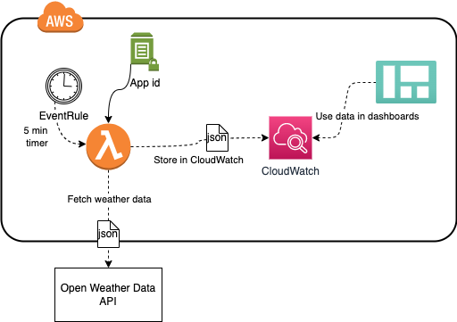

# AWS CDK application for storing weather data to AWS CloudWatch

CloudWatch event rule runs the Lambda every five minutes (for example) which fetches
the weather data and stores relevant temperature, humidity and pressure data in [CloudWatch metrics](https://docs.aws.amazon.com/AmazonCloudWatch/latest/monitoring/working_with_metrics.html).

## What's included?

AWS infrastructure is built with following technology choices:

* [AWS CDK](https://aws.amazon.com/cdk/) infrastructure in TypeScript
* AWS CDK Pipeline for deployment which runs in AWS CodePipeline
* Pipeline is triggered from Github using [AWS CodeStar connection](https://docs.aws.amazon.com/codestar-connections/latest/APIReference/Welcome.html)
* Infrastructure test for CDK
* AWS Lambda running [Node.js 20](https://nodejs.org/en/) for fetching the data
* Node.js starting from Node.js 18 includes [native fetch](https://nodejs.org/en/blog/announcements/v18-release-announce/) which means no external libraries are needed
